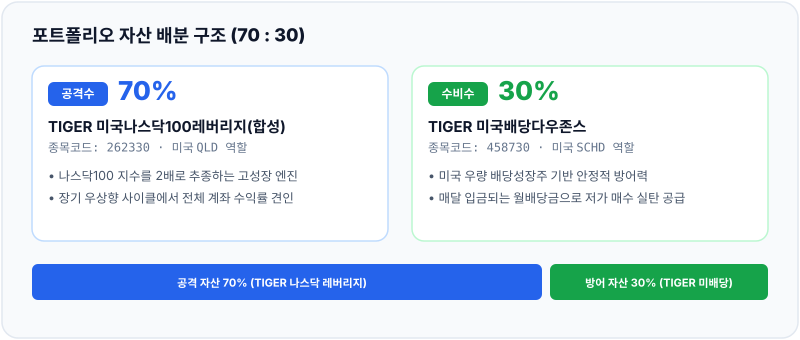
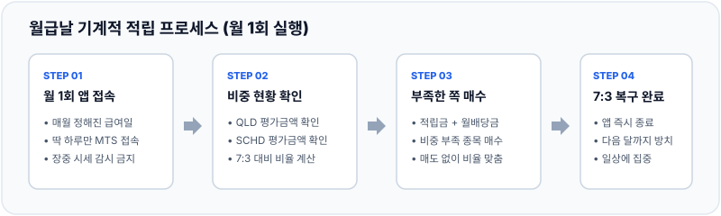
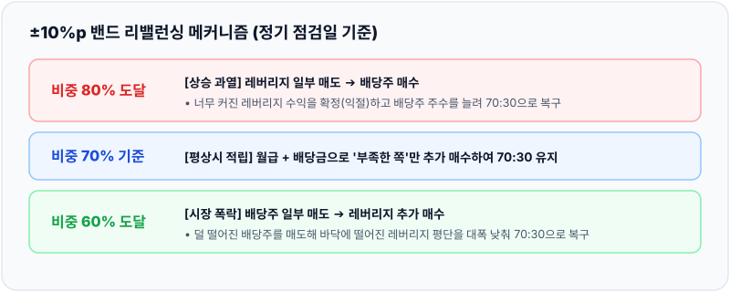
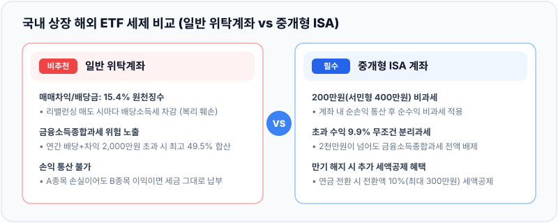
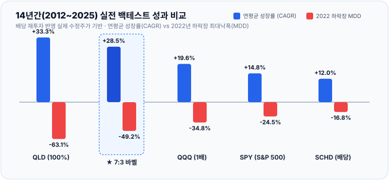

# ISA 7:3 바벨 전략 운용 Rulebook: 레버리지와 배당의 균형

본 문서는 나스닥 2배 레버리지의 성장성과 배당 성장주의 안정적인 현금흐름을 결합해, 변동성을 다스리며 장기 복리 투자를 지속하기 위한 실전 운용 지침서다.

---

## 머리말: 왜 기계적 Rulebook이 필요한가?

주식 시장에서 개인 투자자가 실패하는 가장 큰 원인은 지식 부족이 아니라 뇌동매매(雷同賣買)다.

### 뇌동매매의 정의와 3대 유형
뇌동매매는 투자자 본인의 독자적인 분석이나 확고한 원칙 없이 시장 분위기나 군중 심리에 휩쓸려 충동적으로 매매하는 행위를 뜻한다. '남들이 사니 덩달아 사고, 남들이 파니 공포에 질려 함께 던지는' 악순환이다.

1. **추격 매수 (FOMO):** 특정 종목이 급등할 때 소외될지 모른다는 두려움에 사로잡혀 고점에서 무리하게 따라 들어가는 행위.
2. **패닉 셀링 (공포 투매):** 자산의 본질 가치에 문제가 없는데도 계좌의 파란 불과 시장의 비관론에 놀라 바닥에서 헐값에 처분하는 행위.
3. **카더라 통신 의존:** 사업 모델이나 재무제표에 대한 점검 없이 리딩방, 자극적인 뉴스, 지인 추천에 기대어 깜깜이 매매를 저지르는 행위.

### 뇌동매매가 계좌를 파괴하는 이유
뇌동매매는 투자의 최악인 '고점 매수, 저점 매도(비싸게 사서 싸게 파는 짓)'를 무한 반복하게 만든다. 매수 근거가 모호하므로 작은 하락에도 불안을 견디지 못하고 손절하며, 결국 자산이 녹아내린다.

본 Rulebook은 투자자의 감정과 주관을 철저히 배제하고, 사전에 정의한 수치에 맞춰 기계적으로 자산을 배분하기 위해 설계했다.

---

# [PART 1] 초보자를 위한 3분 퀵스타트 (쉬운 요약판)

복잡한 금융 지식이나 세법을 몰라도 아래 4단계 원칙만 지키면 곧바로 실행할 수 있다.

### 1단계: 준비물 2가지
* **중개형 ISA 계좌 만들기:** 증권사 앱에서 일반 주식 계좌가 아닌 '중개형 ISA'를 개설한다 (세금 혜택 목적).
* **레버리지 사전교육 수강:** 금융투자교육원(kifin.or.kr)에서 1시간짜리 '레버리지 ETF 안내' 영상을 시청하고 이수번호를 증권사 앱에 등록한다 (법적 필수 절차).

### 2단계: 살 종목 딱 2개
* **공격수 (70%):** `TIGER 미국나스닥100레버리지(합성)` [종목코드 262330]  
  - 미국 나스닥 100 지수를 2배로 추종하는 ETF (성장 담당)
* **수비수 (30%):** `TIGER 미국배당다우존스` [종목코드 458730]  
  - 안정적인 미국 우량 배당주에 투자하며 매달 배당금을 주는 ETF (현금 흐름 담당)

### 3단계: 매달 하는 일 (월급날 1회 접속)
* **주기:** 매달 월급날 다음 날, 딱 하루만 앱을 켠다.
* **돈의 출처:** 이번 달 투자할 여유 자금 + 통장에 들어온 배당금
* **행동:** 현재 계좌 평가금액을 보고 7:3 비율에서 비중이 부족한 쪽을 더 산다.
  * 예: 나스닥이 많이 올라 75:25가 되었다면 이번 달에는 배당주만 사서 7:3을 맞춘다.

> [월급날 리밸런싱 계산기](calculator.md)를 활용하면, 현재 계좌 잔고를 기준으로 이번 달에 어떤 종목을 몇 주 사야 7:3이 맞춰지는지 1초 만에 계산할 수 있다.

### 4단계: 비상 리밸런싱 (급등락 시 스위칭)
매달 점검일에 나스닥이 너무 많이 올랐거나 폭락했을 때만 주식을 서로 맞바꾼다.
* **나스닥 폭등 (레버리지 비중 80% 이상):** 레버리지를 일부 팔아 배당주를 산다 (수익 챙기기).
* **나스닥 폭락 (레버리지 비중 60% 이하):** 배당주를 일부 팔아 바닥난 레버리지를 더 산다 (바닥 줍기).
* **목표:** 항상 계좌를 70 : 30 비율로 되돌려 놓는다.

---

# [PART 2] 실전 상세 가이드 (정밀 버전: 원리, 세금, 맹점)

원리와 세무상 이점, 그리고 하락장에서 겪을 현실적 위험을 다룬 상세 지침이다.

## 1. 포트폴리오 메커니즘과 운용사 선정

### TIGER 브랜드를 선택하는 이유
레버리지 ETF는 원하는 가격에 즉시 체결되는 호가 유동성이 필수적이다. 국내 상장 해외 레버리지 및 미국 배당다우존스 상품군 중 시가총액과 일 거래대금이 가장 큰 미래에셋자산운용(TIGER)으로 종목을 단일화하여 호가 스프레드(거래 비용)를 최소화한다.

---

## 2. 절세 구조와 제도적 제약

### 일반 계좌와 중개형 ISA의 세금 비교
1. **일반 위탁계좌의 함정:**
   * 국내 상장 해외 ETF를 일반 계좌에서 매매하면 매매차익과 분배금 전액에 대해 15.4%의 배당소득세가 원천징수된다.
   * 연간 금융소득이 2,000만 원을 넘어가면 금융소득종합과세 대상자로 지정되어 최고 49.5%의 누진세율을 적용받는다.
2. **중개형 ISA의 절세 효과:**
   * 계좌 내 발생한 이익과 손실을 통산하여 순이익 기준 200만 원(서민형 400만 원)까지 완전 비과세된다.
   * 비과세 한도를 초과한 수익에 대해서는 9.9% 분리과세로 종결되며, 종합소득에 합산되지 않는다.
   * 따라서 리밸런싱 과정에서 매매차익이 발생해도 세금 누수 없이 전액 재투자가 가능하다.
3. **납입 한도:**
   * 연간 2,000만 원 한도로 납입할 수 있으며, 쓰지 않은 한도는 이월되어 5년간 최대 1억 원까지 납입할 수 있다.

---

## 3. 매매 및 리밸런싱 실행 원칙

### 1) 월급날 밴드 적립
* 매월 1회 지정일에만 계좌를 확인한다.
* 목표 비율(70:30) 대비 비중이 축소된 자산에 적립금을 집중 투입해 거래 비용(매도 수수료) 없이 자연스러운 균형 복구를 꾀한다.

### 2) 밴드 이탈 시 강제 리밸런싱 (±10%p)
장중 실시간 감시는 뇌동매매를 유발하므로 금지한다. 매월 정기 매수일에만 비중을 확인해 밴드를 벗어났을 때만 스위칭을 실행한다.

* **상승장 리밸런싱 (레버리지 비중 ≥ 80%):**
  * 시장 과열기에 비대해진 레버리지 자산 일부를 매도해 차익을 실현한다.
  * 확보한 현금으로 배당주를 매수해 안정 자산의 주수를 늘리고 월배당 현금 흐름을 확대한다.
* **하락장 리밸런싱 (레버리지 비중 ≤ 60%):**
  * 낙폭이 상대적으로 작은 배당주 일부를 매도한다.
  * 매도 대금으로 저가 영역에 진입한 레버리지 ETF를 적극 매수해 평균 단가를 낮추고 반등 사이클의 회복 탄력을 극대화한다.

> **주문 체결 안내:** 국내 ETF 매도 대금은 결제일까지 2영업일(D+2)이 소요되지만, 대다수 증권사에서는 매도 즉시 결제예정금으로 타 종목 매수가 가능하다. 매도 직후 곧바로 스위칭 매수 주문을 접수하면 된다.

---

## 4. 실전 운용 시 현실적인 맹점과 보완책

### 1) SCHD는 채권이나 현금이 아니다
* TIGER 미국배당다우존스는 안전자산이 아닌 '주식형 ETF'다.
* 금융위기나 금리 충격 시 나스닥보다 덜 떨어질 뿐 주가가 함께 하락한다.
* 따라서 레버리지 비중이 60% 밑으로 떨어져 배당주를 매도할 때, 배당주 역시 손실 구간일 가능성이 높다. "손실 중인 배당주를 손절해 레버리지를 산다"는 심리적 저항을 이겨내야 한다.
* 배당주의 본질적 방어력은 가격 방어보다 '매달 꾸준히 유입되는 월배당금'으로 저가 매수 실탄을 제공하는 데 있다.

### 2) 합성 레버리지의 비용과 변동성 잠식 (Volatility Drag)
* 합성 ETF는 스왑 계약 비용이 수반되어 일반 지수형 ETF 대비 실부담 비용이 높다.
* 지수가 뚜렷한 방향성 없이 등락을 거듭하는 횡보장에서는 음의 복리 효과로 인해 지수 상승률 대비 계좌 성과가 뒤처질 수 있다.

### 3) 초보자를 위한 단계적 비중 권고
* 2배 레버리지 70% 구성은 대세 하락장에서 계좌 총자산이 -40% 이상 하락할 수 있다.
* 하락장 경험이 없는 초보자라면 초기 6개월~1년은 5:5 또는 6:4 비율로 시작하여, 시장 하락 시 리밸런싱 메커니즘을 경험한 후 7:3으로 비중을 단계적으로 올리는 편이 안전하다.

### 4) 리밸런싱 밴드 폭 비교 분석: ±10%p vs ±15%p vs ±20%p
"스위칭 밴드를 ±10%p(80%/60%) 외에 ±15%p(85%/55%)나 ±20%p(90%/50%)로 넓히면 어떨까?"라는 의문에 대해 14년간의 실제 증시 데이터(2012~2025년)로 정밀 시뮬레이션한 결과다.

| 밴드 폭 기준 | 거치식 연평균(CAGR) | 거치식 2022년 MDD | 14년 거치식 스위칭 | 적립식 14년 최종 자산 | 적립식 강제 스위칭 |
| :--- | :---: | :---: | :---: | :---: | :---: |
| **±10%p (권장: 80% / 60%)** | **28.50%** | **-49.23%** | **8회** (익절 6, 저점 2) | **8억 1,923만 원** | **3회** |
| ±15%p (비권장: 85% / 55%) | 28.19% | -50.54% | 2회 (익절 2, 저점 0) | 8억 185만 원 | **0회** |
| ±20%p (초게으름: 90% / 50%) | 28.84% | -54.01% | 1회 (익절 1, 저점 0) | 8억 185만 원 | **0회** |

* **1. 적립식에서 ±15%p와 ±20%p의 성과가 100% 동일한 이유 (스마트 적립의 완충력):**
  * 매달 월급날 비중이 부족한 쪽을 사주는 기계적 적립 덕분에, 14년(168개월) 동안 실제 계좌 내 레버리지(QLD) 비중은 **최저 61.1% ~ 최고 84.0% 구간 안에서만 진동**했습니다.
  * 따라서 밴드를 ±15%p(85%/55%)나 ±20%p(90%/50%)로 넓히면 14년 내내 경계선에 닿지 않아 **강제 스위칭이 단 0회(0번)** 발생하며, 두 전략의 매매 궤적과 최종 자산이 완벽하게 일치합니다.
* **2. 거치식에서 ±15%p가 빠지는 '데드존(Dead Zone)' 함정:**
  * ±15%p는 3개 밴드 중 가장 낮은 연평균 성장률(28.19%)을 기록했습니다.
  * 2021년 말 역사적 고점(비중 80~81%)에서 익절 타이밍을 놓쳐 폭락을 맞았고, 2022년 폭락장 바닥에서도 55%에 닿지 않아 저점 매수 기회를 날렸기 때문입니다.
  * 즉, '고점 매도/저점 매수'라는 리밸런싱의 알파도 못 챙기고, '추세 보유'라는 레버리지의 베타도 훼손된 어중간한 구간입니다.
* **3. 결론: 왜 ±10%p가 압도적인 황금 밸런스(Sweet Spot)인가?:**
  * 폭락장 바닥(2022년)에서 덜 떨어진 배당주로 레버리지를 저가 매수하고, 과열장(2020, 2021, 2024년)에서 레버리지 수익을 확정하는 기계적 선순환이 정확하게 작동합니다.
  * 그 결과 **2022년 폭락장 낙폭을 -49.2%로 철저히 방어**하면서도, 반등장 복리 효과를 극대화해 **적립식 최종 자산 8억 1,923만 원(1위, +1,738만 원 초과 달성)**을 형성합니다.

---

## 5. 백테스트 실전 검증 (2012~2025년 14년간)

실제 미국 증시 데이터(배당 재투자 반영 수정주가)를 바탕으로, SCHD가 상장된 이후 14년간의 장기 성과를 직접 시뮬레이션한 결과다.

### 1) 일시불 거치식 투자 성과 (14년 보유)

| 전략 / 자산 | 총수익률 | 연평균 성장률(CAGR) | 전체 MDD | 2022년 수익률 | 2022년 MDD | 리밸런싱 횟수 |
| :--- | :---: | :---: | :---: | :---: | :---: | :---: |
| **★ 7:3 바벨 리밸런싱** | **+3,238.7%** | **28.50%** | **-49.48%** | **-46.67%** | **-49.23%** | **단 8회** |
| QLD (2배 레버리지 100%) | +5,450.4% | 33.25% | -63.68% | -61.33% | -63.08% | - |
| QQQ (나스닥 100 지수) | +1,129.6% | 19.64% | -35.12% | -33.22% | -34.83% | - |
| SPY (S&P 500 지수) | +589.9% | 14.80% | -33.72% | -18.65% | -24.50% | - |
| SCHD (배당다우존스 100%) | +389.9% | 12.03% | -33.37% | -3.23% | -16.84% | - |

### 2) 월 100만 원 적립식 투자 성과 (실제 직장인 시나리오)

매월 100만 원씩 14년간 꾸준히 적립하여 총 원금 1억 700만 원을 납입했을 때의 실제 최종 계좌 평가액 비교다.

| 전략 구분 | 총 납입 원금 | 최종 평가 금액 | 누적 수익률 | 적립식 MDD |
| :--- | :---: | :---: | :---: | :---: |
| **★ 7:3 바벨 적립** | **1억 700만 원** | **8억 1,923만 원** | **+665.6%** | **-49.17%** |
| QLD 적립 (레버리지 100%) | 1억 700만 원 | 12억 4,216만 원 | +1,060.9% | -62.84% |
| QQQ 적립 (나스닥 100) | 1억 700만 원 | 4억 6,929만 원 | +338.6% | -32.92% |
| SPY 적립 (S&P 500) | 1억 700만 원 | 3억 2,055만 원 | +199.6% | -33.72% |
| SCHD 적립 (배당 100%) | 1억 700만 원 | 2억 4,035만 원 | +124.6% | -33.37% |

### 3) 백테스트 핵심 시사점: 왜 QQQ 단순 보유보다 우월한가?

1. **QQQ 대비 낙폭은 방어하고 수익은 압도적으로 극대화:**  
   * 2022년 금리 인상 폭락장에서 나스닥 1배 지수인 **QQQ의 연간 수익률은 -33.2%, 최대 낙폭(MDD)은 -34.8%**에 달했습니다.
   * 같은 시기 2배 레버리지인 QLD는 -63.1% 폭락해 원금이 1/3토막 났지만, **7:3 바벨 전략은 SCHD(2022년 연간 -3.2%)가 완충재 역할을 하며 낙폭을 -49.2% 수준으로 크게 방어**했습니다.
   * 결정적으로 폭락장 이후 반등 사이클(2023~2025년)을 거치며, 적립식 기준 최종 자산은 **QQQ 적립(4억 6,929만 원) 대비 7:3 바벨 적립(8억 1,923만 원)이 무려 3억 5,000만 원 이상(+327%p 초과) 더 크게 형성**되었습니다.
   * 즉, 3배 레버리지(TQQQ, -80% 이상 폭락)처럼 계좌가 영구 손상될 위험을 배제하면서도, QQQ의 낙폭에서 감내 가능한 수준의 변동성만 허용하는 대가로 약 1.75배의 압도적인 자산을 축적할 수 있습니다.

2. **2배 레버리지(QLD 100%) 몰빵의 현실적 한계 극복:**  
   * QLD 단독 투자는 수치상 연평균 수익률(33.25%)이 높아 보이지만, 2022년에 -63.7% 폭락을 견뎌야 합니다. 1억 원이 3,600만 원으로 쪼그라드는 공포 속에서 패닉 셀링(투매)을 하지 않고 버틸 수 있는 투자자는 극히 드뭅니다.
   * 7:3 바벨 전략은 매달 들어오는 월배당금과 상대적으로 덜 떨어진 SCHD를 매도해 바닥의 레버리지를 줍는 구조이므로 심리적 붕괴(뇌동매매)를 사전에 차단합니다.

3. **14년간 강제 리밸런싱은 단 8회 (적립식은 단 3회):**  
   * 매일 호가창을 보고 긴장할 필요가 없습니다. 14년(3,519 거래일) 동안 거치식 기준 강제 스위칭을 실행한 횟수는 총 8회에 불과했습니다.
   * 특히 월급 적립식의 경우 매달 부족한 쪽을 사주는 스마트 적립 덕분에 **14년 동안 강제 스위칭이 단 3회**만 발생했습니다. 평소에는 그저 월급날 부족한 쪽을 사기만 하면 되므로, 본업에 지장 없이 장기 투자를 우직하게 완주할 수 있습니다.

---

## 6. 만기 및 출구 전략

ISA 의무 가입 기간 3년 경과 후 시장 상황에 맞춰 출구를 선택한다.

* **손실 구간:** 서둘러 해지하지 않고 만기를 연장한다. ISA 만기는 횟수 제한 없이 연장할 수 있으므로 나스닥 사이클 회복 시점까지 버틴다.
* **수익 구간:**
  1. 만기 해지를 통해 비과세 혜택과 9.9% 분리과세로 세금을 종결한다.
  2. 해지 자금을 연금저축펀드 또는 IRP 계좌로 전환한다.
  3. 전환 금액의 10%(최대 300만 원)를 추가 세액공제 받아 실질 수익률을 극대화한다.
